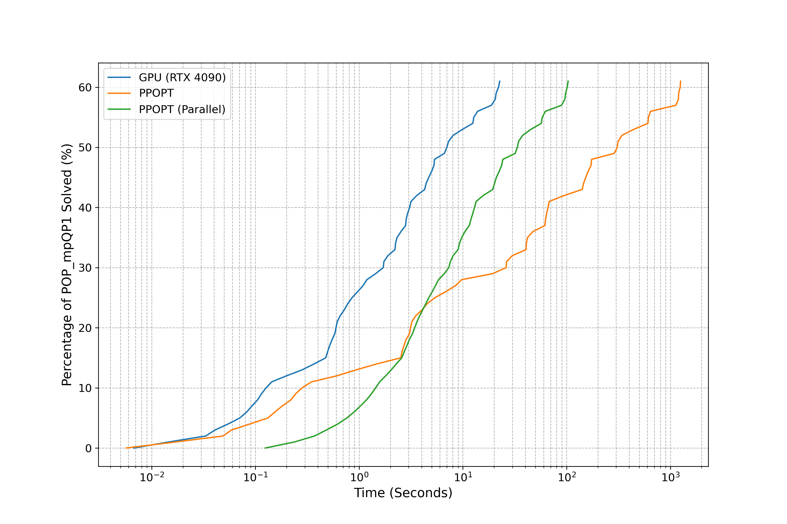

# README

## Overview

This repository contains the code for our GPU-based multiparametric Quadratic Programming (mpQP) solver. The solver is optimised for NVIDIA GPUs, particularly the RTX 4090. It significantly accelerates feasibility and optimality checks for active sets in mpQP and mpLP problems, leveraging advanced parallel combinatorial algorithms and basis-sharing techniques. For a detailed description of the algorithm and its performance, please refer to our accompanying paper.


## Installation

### Prerequisites

To run this solver, ensure the following software is installed on your system:

- **CUDA 12.2**: Required for GPU acceleration. Follow the installation guide from the [official NVIDIA CUDA documentation](https://developer.nvidia.com/cuda-toolkit).
- **Gurobi 10.0.3**: Necessary for advanced optimisation tasks. Visit the [Gurobi installation guide](https://www.gurobi.com/documentation/) for detailed setup instructions.
- **Python**: Ensure Python 3.8 or higher is installed on your system.

### Python Dependencies

Install the required Python packages using `pip`:

```bash
pip install ppopt==1.5.1
pip install numpy==1.24.3
```

## Running the Code

To execute the solver, run the following command in your terminal:

```bash
python main.py
```

## Optimising for Different GPUs

The codebase is tailored for various GPU architectures. Follow these guidelines to optimise performance for your specific GPU:

- **RTX 4090**: The provided `.so` files are pre-optimised for the RTX 4090.
- **H100**: For improved performance on H100 GPUs, modify the CUDA code by replacing all instances of `int` with `size_t` in the relevant files.

## Algorithm Performance

The experimental results demonstrate significant speedups on modern GPUs:

- **RTX 4090**: Achieves up to 24.87× speedup compared to state-of-the-art solvers.
- **H100**: Achieves up to 82.35× speedup with appropriate optimisations.
